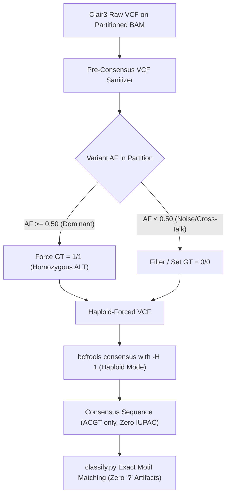

# Architectural Specification: 500-Dataset Genomic Simulation, Clinical HGVS Nomenclature, Consensus Disambiguation, and IGV Visualization

**Document ID:** `SPEC-20260915-CLINICAL-GENOMIC`  
**Version:** 1.0.0  
**Date:** 2026-09-15  
**Author:** Antigravity (Pair Programming with User)  
**Status:** In Review  
**Target Release:** MucOneSpan v0.13.0+  

---

## 1. Executive Summary & Mission

MucOneSpan was established as an open-source, branch-aware Python bioinformatics package for MUC1 VNTR analysis of PacBio HiFi and Oxford Nanopore Technologies (ONT) long-read sequencing data. In release `v0.12.0`, the system achieved robust target ladder alignment, quality gating, and initial 200-dataset benchmark validation.

However, clinical diagnostic translation for autosomal dominant tubulointerstitial kidney disease caused by MUC1 mutations (ADTKD-MUC1) requires addressing five critical engineering and scientific frontiers:

1. **Native Genomic / Adaptive Sampling Simulation:** Expanding beyond amplicon PCR simulation (which exhibited severe length-dependent amplification dropout on 25 vs 140 repeat alleles) to simulate native high-molecular-weight (HMW) DNA with unamplified 1:1 stoichiometric representation and staggered genomic flanks (10 kb).
2. **~500-Dataset Stratified Simulation Catalog:** Scaling the benchmark catalog from 200 datasets to ~500 datasets with rigorous stratification across development (300), validation (100), and held-out test (100) splits, complete with dual cryptographic ledgers (generation and evaluation).
3. **Consensus Replay & IUPAC Elimination:** Resolving the empirical root cause where Clair3 called minor read noise as `0/1` on partitioned single-allele BAMs, causing `bcftools consensus` to inject ambiguous IUPAC characters (`S`, `M`, `R`, `Y`), leading to 95.3% of length-exact sequence mismatches and `?` repeat-unit classifications.
4. **Official HGVS Nomenclature Alignment:** Full alignment with international HGVS standards (https://hgvs-nomenclature.org/stable/), accounting for the reverse-strand transcription orientation of MUC1 (chr1:155,185,824-155,192,915 on GRCh38), the 3'-most rule in cDNA (`NM_001204286.1`), HGVS repeated sequence restrictions for coding frameshifts, and 3-tier clinical evidence reporting.
5. **Interactive IGV Report Integration:** Embedding offline, zero-CDN, interactive alignment visualization (`igv.js`) into per-sample HTML reports (supporting both embedded and sidecar modes, referencing the architectural patterns of `VNtyper`).

---

## 2. Workstream 1: Native Genomic Read Simulation (Adaptive Sampling & PBSIM3/CCS)

### 2.1 The Biological Difference: Amplicon PCR vs. Native Genomic Capture

| Property | Amplicon PCR (`muconeup reads amplicon`) | Adaptive Sampling / Native Genomic (`muconeup reads ont` / `pacbio`) |
| :--- | :--- | :--- |
| **Physical Substrate** | PCR amplicon flanked by fixed primers | High-molecular-weight (HMW) genomic DNA |
| **Allele Stoichiometry** | Strongly length-biased (exponential PCR bias) | 1:1 equimolar representation ($50\% / 50\%$) |
| **Extreme Asymmetry (25 vs 140 RU)** | 140 RU allele dropped below detection limit at $\le 100$ templates | Both 25 RU and 140 RU alleles sequenced at equal nominal depth |
| **Read Termini** | Fixed at primer binding sites | Staggered random shearing breakpoints extending into 10 kb unique flanks |
| **Simulation Engines** | Synthetic PCR bias model + platform error models | NanoSim 3.2.2 (ONT k-mer error model) & PBSIM3 + CCS (PacBio HiFi) |

### 2.2 Integration Architecture with `MucOneUp`

MucOneUp provides native command-line interfaces for genomic simulation:
- **ONT Simulation:** `muconeup --config <config> reads ont <truth.fa> --out-dir <dir> --coverage <cov> --seed <seed>`
  - Uses NanoSim with empirical R10.4.1 dorado v3.2.1 error profiles.
  - Generates BAM aligned to GRCh38 via `minimap2 -ax map-ont` and merged FASTQ.
- **PacBio HiFi Simulation:** `muconeup --config <config> reads pacbio <truth.fa> --out-dir <dir> --coverage <cov> --seed <seed> --threads 8`
  - Runs PBSIM3 multi-pass CLR simulation followed by `ccs` circular consensus generation ($RQ \ge 0.99$, Q20/Q30) and `minimap2 -ax map-hifi`.
- **Reference Management:**
  Simulation requires running with working directory set to `/home/bernt-popp/development/MucOneUp` or setting absolute paths in `config_experiment.json` so that NanoSim training data (`reference/nanosim/...`) and the GRCh38 analysis set (`reference/GCA_000001405.15_GRCh38_no_alt_analysis_set.fna`) are resolved unambiguously.

---

## 3. Workstream 2: ~500-Dataset Stratified Simulation Catalog & Cryptographic Ledgers

### 3.1 Catalog Size and Split Allocation

The benchmark catalog expands from 100 biological designs (200 datasets) to 250 biological designs evaluated across sequencing modalities to produce **500 total evaluation datasets**:

| Split | Number of Designs | Total Datasets | Purpose |
| :--- | :---: | :---: | :--- |
| **Development (`dev`)** | 150 designs | 300 datasets | Algorithm development, parameter tuning, regression tests |
| **Validation (`val`)** | 50 designs | 100 datasets | Hyperparameter locking, threshold optimization |
| **Held-Out Test (`test`)** | 50 designs | 100 datasets | Blinded, immutable final diagnostic benchmark |
| **Total** | **250 designs** | **500 datasets** | Comprehensive diagnostic evaluation |

### 3.2 Modality and Technology Stratification

Each design is executed across dedicated sequencing modalities:
1. **Targeted Amplicon PCR:** 150 datasets (75 PacBio HiFi, 75 ONT). Tests PCR efficiency curves, amplification dropout, and primer-boundary resolution.
2. **Adaptive Sampling / Native Genomic ONT:** 175 datasets. Tests unamplified native long reads spanning through the VNTR with staggered flanking alignments.
3. **Native Genomic PacBio HiFi:** 175 datasets. Tests high-accuracy ($Q \ge 20$) reads without PCR length bias.

### 3.3 Biological Design Categories

The 250 biological designs span 7 clinical challenge categories:

1. **Extreme Length Asymmetry (35 designs):**
   - Haplotypes: 25 vs 100, 25 vs 120, 25 vs 140, 30 vs 100, 30 vs 130 repeats.
   - Purpose: Verifies whether native genomic capture eliminates the amplicon PCR dropout of ultra-long alleles.
2. **Homozygous Identical Haplotypes (25 designs):**
   - Haplotypes: 30/30, 40/40, 50/50, 60/60, 70/70, 80/80, 100/100, 120/120.
   - Verified with authored identical structure files (`identical_L_L.txt`).
3. **Small Length Gaps / Resolution Limits (35 designs):**
   - 1-RU gaps: 40/41, 50/51, 60/61, 70/71, 79/80, 99/100.
   - 2-RU gaps: 40/42, 50/52, 60/62, 80/82.
   - 3-RU gaps: 40/43, 60/63, 80/83.
4. **Equal Length, Sequence-Divergent (25 designs):**
   - 50/50, 60/60, 70/70, 80/80 with distinct internal motif chains (e.g. allele 1 rich in motifs A/B, allele 2 rich in motifs D/E).
5. **Pathogenic ADTKD-MUC1 Mutations (90 designs):**
   - **`59dupC` (Canonical C-tract duplication, Kirby 2013):** Placed on short allele, long allele, and equal alleles at early, middle, and late repeat positions.
   - **`56_59dupCCCC` (Vrbacka 2025):** 4-bp duplication in C-tract.
   - **`58_59insG` (Olinger 2020):** 1-bp insertion interrupting C-tract.
   - **`60dupA` (Olinger 2020):** Duplication of the terminal A of the repeat unit.
   - **`54_56delinsAT` (Olinger 2020):** Complex indel within the C-tract.
   - **`1_5delGCCCA` (Saei 2023):** 5-bp deletion at unit start.
   - **`30_31ins...` (Saei 2023):** 25-bp complex insertion.
   - **`del18_31`:** Structural deletion of 14 bp within canonical repeat.
6. **Benign Polymorphic Variations (20 designs):**
   - Frame-neutral repeat transitions, benign non-pathogenic unit substitutions (`23dupC`).
7. **Coverage / Template Stress Regimes (20 designs):**
   - Ultra-low coverage: 10x genomic / 20 amplicon templates.
   - Diagnostic standard: 30x genomic / 150-200 amplicon templates.
   - High depth: 60x genomic.

### 3.4 Dual Cryptographic Ledgers

To ensure complete scientific auditability and zero data leakage:
- **`generation_ledger.json`:**
  - Emitted at simulation time.
  - Records: `design_id`, `dataset_id`, `split`, `category`, `mode` (`amplicon` vs `genomic`), `platform` (`hifi` vs `ont`), `bio_seed`, `read_seed`, `coverage`, truth FASTA path and SHA-256, FASTQ path and SHA-256, aligned BAM path and SHA-256, simulator versions (`muconeup`, `nanosim`, `pbsim3`, `minimap2`), generation timestamp.
- **`evaluation_ledger.json`:**
  - Emitted at pipeline benchmarking time.
  - Records: `dataset_id`, `pipeline_commit`, `run_timestamp`, `truth_lengths`, `predicted_lengths`, `length_error`, `truth_structure`, `predicted_structure`, `structure_exact`, `truth_sequence_hash`, `predicted_sequence_hash`, `sequence_edit_distance`, `truth_mutations`, `called_mutations`, `hgvs_call`, `classification_time_sec`, `peak_memory_mb`.

---

## 4. Workstream 3: Elimination of IUPAC Ambiguity & Consensus Replay Architecture

### 4.1 Root-Cause Analysis

In `MucOneSpan v0.12.0`, exact repeat length was achieved for 93.2% of HiFi alleles, but exact sequence concordance was only 44.3%. Deep inspection revealed that **95.3% of length-exact sequence mismatches were caused by IUPAC ambiguous base codes (`S`, `M`, `R`, `Y`)** in the consensus sequence:

1. Clair3 evaluates reads in `allele_1` or `allele_2`. Although the reads derive from a single physical allele, minor sequencing noise or mapping cross-talk (e.g. 15% noise) leads Clair3 to call a true variant with AF ~0.70–0.85 as `0/1` (heterozygous).
2. `bcftools consensus` with `-H I` (IUPAC mode) converts `0/1` into IUPAC codes (e.g. C/G $\to$ `S`, C/A $\to$ `M`).
3. In `classify.py`, any 60 bp repeat unit containing an IUPAC ambiguity character fails exact matching against the 34 catalog units and is tagged as `?` (unknown).
4. In strict evaluation, `S != G` yields an edit distance of 1–2 bp, failing sequence exactness.

### 4.2 Three-Tier Disambiguation Architecture

To eliminate spurious IUPAC characters while preserving genuine variant signal:



1. **Haploid-Majority VCF Transformation (`filter_vcf`):**
   - For all single-allele partitions, inspect FORMAT/AF (or calculate from FORMAT/AD).
   - If `AF >= 0.50` (or configurable threshold, e.g. 0.60): Rewrite GT to `1/1` and ALT allele.
   - If `AF < 0.50`: Filter out variant or rewrite GT to `0/0`.
   - Remove any residual `0/1` or `0|1` records from the consensus VCF.
2. **Haploid Consensus Execution (`build_consensus`):**
   - Invoke `bcftools consensus` with `-H 1` (or `-H 2` matching the evidenced genotype) rather than `-H I`.
   - Set missing/uncovered sites to reference base (`-M N` only for genuinely uncovered spans).
3. **Consensus Sequence Post-Validation:**
   - Add assertion / check in `muc_one_span.consensus` ensuring that trimmed VNTR consensus contains strictly `[ACGTNacgtn]` without IUPAC ambiguity codes.

---

## 5. Workstream 4: Official HGVS Nomenclature Compliance & Clinical Evidence Reporting

### 5.1 Genomic Coordinates and Strand Geometry of MUC1

- **Locus:** Chromosome 1, `NC_000001.11:g.155185824_155192915` (GRCh38).
- **Strand:** **Negative (Reverse) Strand**.
- **Canonical Transcript:** `NM_001204286.1` (13 exons, coding sequence spans the VNTR in Exon 2).
- **Orientation Implications:**
  - Transcription proceeds from right to left in genomic coordinates: Genomic 5' is cDNA 3', and Genomic 3' is cDNA 5'.
  - The HGVS 3'-most rule in coding cDNA (`c.`) moves in the direction of increasing nucleotide indices within the coding repeat unit (1 $\to$ 60).
  - In genomic coordinates (`g.`), the cDNA 3'-most position corresponds to the **lowest genomic coordinate** (genomic left).

### 5.2 HGVS Repeated Sequence Syntax and Constraints

According to official HGVS recommendations (https://hgvs-nomenclature.org/stable/recommendations/DNA/repeated/):
1. **The Multiple-of-3 Coding Rule:**
   - In coding DNA references (`c.`), repeat notation `c.seq[N]` is permitted **ONLY when the repeat unit length is a multiple of 3** (i.e. does not disrupt the reading frame).
   - *Direct Consequence:* A 1-bp insertion or duplication within the 7xC homopolymer tract **CANNOT** be described as `c.53C[8]` under official HGVS `c.` notation!
   - Under HGVS, frameshifting insertions in homopolymer tracts **MUST** be described as duplications or insertions:
     - Applying the 3'-most rule to the 7xC tract (repeat unit positions 53–59), the duplication of a C is placed at position 59:
       **`59dupC`** (or `c.59dup`).
2. **Ambiguity Interval:**
   - Because the homopolymer tract consists of 7 identical cytosines at positions 53–59, an insertion at position 53, 54, 55, 56, 57, 58, or 59 results in the identical biological sequence.
   - The ambiguity interval is **`(53, 59)`**.
   - Reporting this interval resolves historical confusion in the literature (e.g. why Kirby 2013 called it `c.53insC`, others called it `c.428insC` or `54dupC`).
3. **Repeat Tract Representation:**
   - In repeat-unit relative shorthand: **`53C[7]>53C[8]`** precisely describes the copy-number transition of the homopolymer tract without arbitrarily asserting which specific base was duplicated.

### 5.3 Clinical Reporting Schema

Each called variant in `MucOneSpan` will be formatted with a structured clinical nomenclature dictionary:

```json
{
  "variant_id": "MUC1_VNTR_59dupC",
  "canonical_name": "59dupC",
  "event_type": "duplication",
  "unit_anchor": "X",
  "unit_position": 59,
  "ambiguity_interval": [53, 59],
  "repeat_form": "53C[7]>53C[8]",
  "hgvs_cdna_shorthand": "c.59dup",
  "hgvs_genomic": "NC_000001.11:g.[coord]dup",
  "consequence": "frameshift",
  "pathogenicity": "pathogenic",
  "disease_association": "ADTKD-MUC1",
  "literature_citations": [
    "Kirby et al. 2013 (PMID: 23396133)",
    "Wenzel et al. 2018 (PMID: 29520014)",
    "Vrbacka et al. 2025 (doi: 10.1101/2024.11.14.623419)"
  ],
  "confidence_tier": "Tier_A",
  "tier_rationale": "High read support (DP >= 15), concordance across partitioned BAM and Clair3 VCF, canonical motif context"
}
```

---

## 6. Workstream 5: Interactive IGV Report Integration (Zero-CDN, Embedded & Sidecar)

### 6.1 Architecture Overview

Clinical diagnostic reports require interactive visual review of read alignments at variant loci by molecular pathologists, while respecting strict data-privacy regulations (HIPAA, GDPR) requiring zero external network calls (no CDNs, no external tracking scripts).

Following the battle-tested design in `../VNtyper`:
1. **Sidecar Mode (`--report-igv sidecar`):**
   - Generates a standalone `igv_report.html` file beside the primary `report.html`.
   - Contains a complete offline mini-browser powered by vendored `igv.min.js`.
   - The primary report links to this sidecar report with an interactive badge.
2. **Embedded Mode (`--report-igv embedded`):**
   - Extracts the generated `tableJson` and `sessionDictionary` payloads and embeds the interactive IGV viewer directly into a dedicated section of the primary `report.html`.

### 6.2 Track Configuration & Locus Definitions

- **Locus Windows:**
  - VNTR Locus: The entire VNTR region plus 100 bp flanking sequence.
  - Variant Windows: 50 bp flanking each detected pathogenic or ambiguous variant site.
- **Tracks Included:**
  1. **Reference Track:** Selected ladder contig FASTA or GRCh38 local genomic extract.
  2. **Alignment Tracks:** Sorted, indexed BAM files for `allele_1` and `allele_2` (or full MUC1 target BAM). Reads colored by strand or phase tag (`HP`).
  3. **Variant Track:** Filtered VCF track displaying called SNVs and indels with QUAL scores.
  4. **Annotation Track:** BED track showing the exact 60-bp boundaries of each classified repeat unit (`1`, `2`, `X`, `A`–`W`, `6`–`9`).

---

## 7. Verification & Implementation Roadmap

```mermaid
flowchart TD
    subgraph Phase 1: Engine & Disambiguation
        M1["Implement Haploid-Forced Consensus Replay (vcf.py, consensus.py)"]
        M2["Validate Zero IUPAC on Existing 200 Catalog (Verify >90% Sequence Exactness)"]
    end
    subgraph Phase 2: HGVS & Clinical Nomenclature
        M3["Create muc_one_span/nomenclature.py with HGVS & 3'-Rule Normalization"]
        M4["Unit Tests for Nomenclature (59dupC, 56_59dupCCCC, 58_59insG, delins, etc.)"]
    end
    subgraph Phase 3: Genomic Simulation & 500-Dataset Catalog
        M5["Update scripts/build_500_design.py (250 Designs across 7 Categories)"]
        M6["Update scripts/run_500_experiment.py (Supporting Amplicon + NanoSim + PBSIM3/CCS)"]
        M7["Generate Cryptographic Dual Ledgers (generation_ledger.json)"]
    end
    subgraph Phase 4: IGV Reporting
        M8["Implement Offline IGV Report Generator (report_igv.py, templates)"]
        M9["Wire into muc_one_span report CLI and HTML Templates"]
    end
    subgraph Phase 5: Adversarial Review & Final Release
        M10["Multi-Model Adversarial Checkpoint (Claude Fable 5.1 CLI)"]
        M11["Execute make ci-check (>=80% Branch Coverage, File Size <650 Lines)"]
        M12["Release MucOneSpan v0.13.0"]
    end

    Phase 1 --> Phase 2
    Phase 2 --> Phase 3
    Phase 3 --> Phase 4
    Phase 4 --> Phase 5
```

### 7.1 Quality Contract Enforcements
- All modified Python files must remain strictly under 650 physical lines (maximum 649 lines).
- Type checking with `mypy --strict` passing with 0 errors.
- Unit test suite maintaining $\ge 80\%$ branch-aware coverage via `make ci-check`.
- Deterministic random seeds across all simulation and evaluation pipelines.
