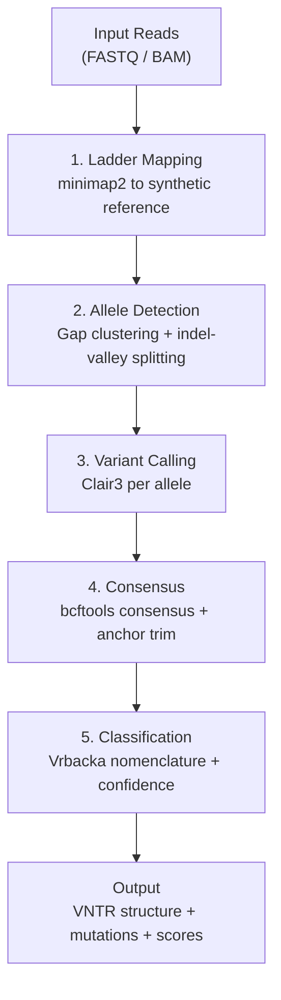
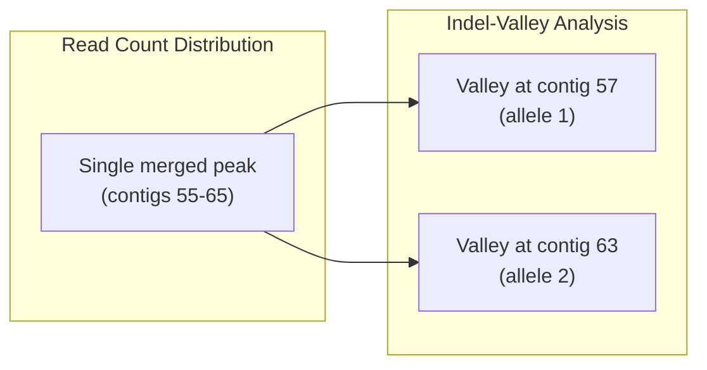
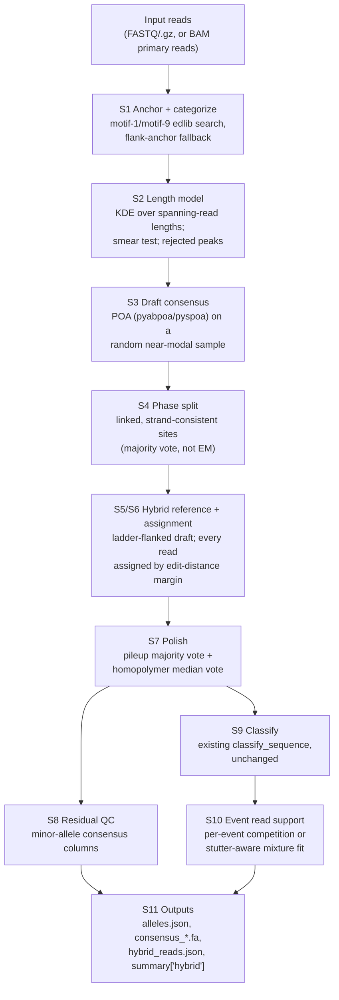

# Core Concepts

Understanding the fundamental concepts behind MucOneSpan helps you interpret results accurately and troubleshoot edge cases.

---

## Pipeline Architecture

MucOneSpan executes five stages sequentially. Each stage produces intermediate files that feed into the next.



---

## Reference Ladder

The first stage maps reads against a **synthetic reference ladder** -- a FASTA file containing 150 contigs, each representing a MUC1 VNTR with a different number of repeat units (1 to 150).

**Each contig is structured as:**

```
[flanking 500bp] [pre-repeats 1-5] [N x canonical 60bp X repeat] [after-repeats 6-9] [flanking 500bp]
```

**Why a ladder?**

Reads from a given allele will map best to the contig whose repeat count matches the allele length. By counting how many reads align to each contig (via `samtools idxstats`), the pipeline identifies the two allele lengths as peaks in the read count distribution.

!!! note "Ladder range"
    The default ladder spans 1-150 repeat units, covering the full observed range of MUC1 VNTR alleles (Vrbacka et al. report alleles up to 125 repeats). The workflow described by Vrbacka et al. used 1-120.

---

## Allele Detection

### Gap-Based Clustering

The primary allele detection method looks for a **gap** in the read count distribution across contigs. Two distinct peaks separated by zero-count contigs indicate two alleles of different lengths.

### Indel-Valley Splitting

When two alleles differ by fewer than ~10 repeats, their read count distributions overlap, creating a single broad peak instead of two. **Gap-based clustering cannot separate them.**

MucOneSpan solves this with **indel-valley analysis**:

1. For each contig with mapped reads, compute the **mean CIGAR indel length** of all reads
2. Reads aligned to the correct-length contig have near-zero indels
3. Reads aligned to a wrong-length contig have large indels (~60bp per repeat of mismatch)
4. Two **local minima (valleys)** in the indel series correspond to the two true allele lengths



!!! tip "Benchmark result"
    Indel-valley splitting resolves allele pairs as close as 3 repeats apart. 12/12 close allele pairs in the test suite are correctly resolved.

---

## Variant Calling

After allele detection, reads are partitioned by allele and **remapped to the corresponding peak contig**. Clair3 is then run independently per allele using the PacBio HiFi model.

**Key details:**

- **Per-allele calling** -- each allele gets its own Clair3 run against its peak contig
- **VCF quality filtering** -- variants are filtered by QUAL and genotype quality
- **Empty VCF handling** -- if Clair3 finds no variants (normal allele), the pipeline continues gracefully
- **Same-length alleles** -- disambiguated using Clair3 heterozygous genotype detection

!!! warning "Clair3 model required"
    You must provide a path to the Clair3 HiFi model via `--clair3-model`. Without it, variant calling will fail.

---

## Consensus Construction

**bcftools consensus** applies Clair3 variants to the reference contig to build a per-allele consensus FASTA. The consensus represents the actual VNTR sequence of each allele.

**Anchor-based flanking trim:**

After consensus construction, the pipeline trims flanking sequences using **anchor-based boundary detection** rather than fixed-position trim. This is resilient to indels in the flanking region caused by Clair3 false positive calls near the VNTR boundaries.

---

## Repeat Classification

Each consensus sequence is split into 60bp units and classified using the **Vrbacka nomenclature**.

### Classification Strategy

1. **Exact match** -- compare each 60bp unit against all known repeat type sequences
2. **Mutation template probing** -- if no exact match, compare against pre-computed mutation templates (13 known mutations)
3. **Edit distance fallback** -- if no template matches, find the closest repeat type by Levenshtein distance and report as a novel mutation

### Mutation Template Matching

For known mutations (e.g., dupC), the pipeline has **pre-computed the exact sequence** that each repeat type would have after the mutation is applied. This enables O(1) lookup:

```
Input:  60bp unit from consensus
Step 1: Check exact match against 34 known repeat types      --> match? done
Step 2: Check exact match against known mutation templates       --> match? report mutation
Step 3: Compute edit distance against all repeat types        --> report as novel
```

### Confidence Scoring

Each classified repeat receives a **confidence score** (0.0 to 1.0):

- **1.0** -- exact match to a known repeat type or mutation template
- **0.8-0.99** -- close match (1-2 substitutions from a known type)
- **< 0.8** -- low confidence, may indicate sequencing error or novel variant

The **allele confidence** is the mean of all per-repeat confidences. VCF cross-validation can further adjust scores when Clair3 variants confirm or contradict the classification.

---

## Hybrid Engine (Experimental)

`muconespan run --engine hybrid` replaces stages 2-5 above with a read-centric
reconstruction that never invokes minimap2, Clair3 or bcftools for FASTQ input
(a BAM input still needs `samtools` to extract primary reads). It is
**experimental and not the default**: `ladder` remains the default engine until
the benchmark decision rule is met on the sealed test split, and
`--report-igv` is unavailable with `--engine hybrid` because a hybrid run
produces no BAM alignment tracks.

!!! warning "Experimental, not the default"
    `--engine hybrid` is opt-in. Every `hybrid.*` setting default is
    provisional (prototype-derived) and tuned on development/validation splits
    only -- never on the sealed test split. See the
    [configuration guide](../guides/configuration.md#hybrid-engine-experimental)
    for every setting and the
    [known limitations](../reference/limitations.md#hybrid-engine-experimental)
    for measured detection limits.

### Stages



This implementation deviates from the original design in a few recorded ways
(`hybrid/engine.py`'s module docstring):

- no ladder-assisted length prior and no ladder-seeded consensus for
  low-depth peaks (S2/S3);
- `depth_status` is judged on spanning reads only (assigned-but-not-spanning
  reads are not yet an alternative depth basis);
- per-event read-level support (S10) uses the spanning members assigned to an
  allele, not every assigned read;
- the phase split (S4) uses a majority vote over linked sites, not the
  prototype's EM read-phasing;
- there is no optional Clair3-on-own-consensus QC step.

### Evidence, not a silent call

Every stage that discards or cannot resolve something records why, instead of
staying silent:

- **Per sample** (`summary["hybrid"]`): `read_categories` (`spanning`,
  `left_anchored`, `right_anchored`, `internal_or_offtarget`), `rejected_peaks`
  (each candidate length peak that did not become an allele, with its reason:
  `noise`, `smear`, `smear_ambiguous`, `support_below_threshold`,
  `max_alleles`), `undecided_reads`, `off_target_reads`,
  `unassigned_spanning_fraction`, `short_product_fraction`,
  `selection_status`, `poa_backend`.
- **Per allele**: `spanning_reads`, `assigned_reads`, `depth_status`
  (`adequate`/`low`/`insufficient`), `selection_status`
  (`resolved` or an `unresolved_*` reason), `split_basis`, `phase_status`,
  `residual_sites`, `consensus_concordance_fraction`.
- **Per event**: `read_support` -- read-level counts and a status
  (`supported`/`insufficient_depth`/`discordant`/`not_supported`/
  `not_localized`) computed directly from the reads assigned to that allele.

The [configuration guide](../guides/configuration.md#hybrid-engine-experimental)
describes every field and setting; the
[limitations page](../reference/limitations.md#hybrid-engine-experimental)
describes measured detection limits and validation numbers.

---

## Next Steps

- **[Differences from the Published Method](deviations.md)** -- What changed and why
- **[Known Mutations](../reference/mutations.md)** -- Full mutation catalog
- **[Repeat Nomenclature](../reference/nomenclature.md)** -- Classification system details
- **[Benchmarking](../guides/benchmarking.md)** -- Validate with simulated data
